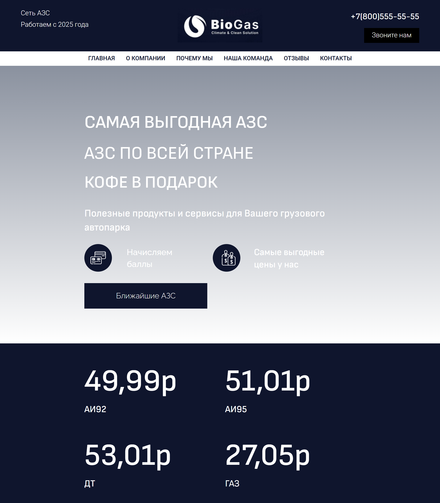

# GasStation

GasStation — это специальное место (далее автозаправка, АЗС), где транспортные средства заправляют топливом: бензином, дизелем.
Задача - продажа топлива и заправка транспортных средств.

## Визуальная схема фронтенда

## Документация

1. Маркетинг и аналитика
   1. [Целевая аудитория](./docs/01-biz/01-target-audience.md)
   2. [Заинтересанты](./docs/01-biz/02-stakeholders.md)
   3. [Пользовательские истории](./docs/01-biz/03-bizreq.md)
2. Аналитика:
   1. [Функциональные требования](./docs/02-analysis/01-functional-requiremens.md)
   2. [Нефункциональные требования](./docs/02-analysis/02-nonfunctional-requirements.md)
3. DevOps
   1. [Файлы сборки](./deploy)
4. Архитектура
   1. [Описание API](docs/03-architecture/01-api.md)
   2. [Компонентная схема](docs/03-architecture/02-arch.md)
5. Тесты